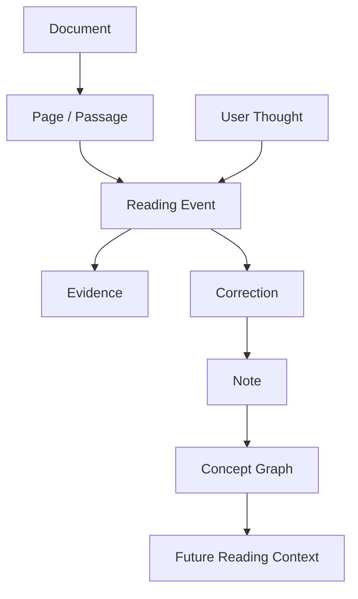

# PDF 阅读纠错与笔记 Agent 设计方案

## 1. 产品定位

本项目旨在构建一个面向深度阅读的智能学习伙伴，而不是普通的 PDF 问答机器人。

当用户阅读 PDF、对某一页面或段落产生想法时，系统能够：

1. 捕获用户正在阅读的位置及相关上下文；
2. 记录用户当时的原始想法；
3. 检索 PDF 内部及必要的外部证据；
4. 判断用户理解中正确、错误或缺少条件的部分；
5. 通过解释、反例或追问帮助用户修正理解；
6. 在讨论结束后生成结构化笔记；
7. 保存用户的学习轨迹，并与既有知识建立关联。

核心原则是：**以“阅读事件”为中心，保留原始思考，再在其上叠加证据、纠正和最终笔记。**

---

## 2. 核心使用流程


示例：

> 用户：这里是不是说，过参数化可以保证 Jacobian 满秩？

系统首先收集：

- 当前页和选中段落；
- 当前页的页面截图；
- 前后相关页面；
- 本章对 overparameterization、full rank、submersion 和 NTK 的描述；
- 用户过去关于 Jacobian 的相关笔记。

然后给出类似回答：

> 你的理解抓住了作者的直觉，但“保证”一词太强。原文使用的是 “heuristic suggests” 和 “we expect”，说明这里是维数计数启发，而不是严格定理。参数数量多只使满秩在维数上成为可能，并不自动保证实际满秩。

讨论完成后，系统再根据用户确认过的理解生成笔记。

---

## 3. 界面设计

第一版可以由三个主要区域组成。

### 3.1 PDF 阅读区

支持以下功能：

- PDF 翻页与全文搜索；
- 选择文字；
- 框选公式和图表；
- 高亮与批注；
- 获取当前页面或局部区域截图；
- 识别当前页码、章节、公式编号和图表编号。

系统除传入用户选中的内容外，还应默认读取相邻页面。如果发现以下指代表达，可以进一步扩大上下文范围：

- as discussed above；
- therefore；
- these statements；
- the previous result；
- 由此可知；
- 如上所述。

### 3.2 思考与对话区

建议提供以下明确操作：

- 记录想法；
- 检查我的理解；
- 解释这段内容；
- 寻找反例；
- 联系前文；
- 生成笔记。

语音或文字输入完成时，系统自动生成一个阅读事件：

```text
文档：Understanding Deep Learning
页面：23
选区：式 (1.3.4) 及其下方段落
时间：2026-08-13 16:20
原始想法：这里是不是说过参数化能保证 Jacobian 满秩？
```

### 3.3 笔记预览区

系统展示即将保存的笔记，并允许用户修改。可以提供三个关键操作：

- 接受修正；
- 保留我的原观点；
- 继续讨论。

Agent 不应在未经确认时，把自己的解释直接当作用户的最终结论。

---

## 4. 系统架构

第一版可以由一个主 Agent 调度以下六个模块，不必过早拆分成多个独立 Agent。

### 4.1 阅读上下文捕获器

负责将“用户正在看什么”转换成结构化数据。

```json
{
  "document_id": "book_001",
  "page": 23,
  "chapter": "1.3",
  "selection_text": "a heuristic dimension-counting argument suggests...",
  "selection_image": "page23_crop.png",
  "nearby_pages": [22, 23, 24],
  "user_thought": "参数更多是不是就保证满秩？"
}
```

文字与截图需要同时保留：

- 文字便于全文搜索、语义检索和引用；
- 截图便于识别公式、图表、符号及排版关系。

### 4.2 PDF 索引器

导入 PDF 后，对整份文档进行预处理：

- 按页提取文字；
- 对扫描页执行 OCR；
- 识别标题、章节和段落；
- 保存段落对应的页码和页面坐标；
- 建立语义向量索引；
- 提取公式编号、图表编号和参考文献；
- 保留页面渲染图像。

建议同时建立两类索引：

1. **关键词索引**：用于查找精确术语、公式编号和原句；
2. **语义索引**：用于查找概念相近但表述不同的段落。

每条检索结果必须保留文档、页码和页面坐标，确保解释可以被用户核查。

### 4.3 证据检索器

检索顺序应尽量固定：

```text
当前选区
  → 相邻页面
  → 当前章节
  → 整本 PDF
  → 书中引用的资料
  → 外部可靠资料
```

理解一本书时，应优先还原作者自己的术语体系，而不是立即使用外部搜索。

检索器输出一个证据包：

```json
{
  "local_evidence": [
    {
      "page": 22,
      "text": "under what assumptions...",
      "relevance": "定义了作者所说的 open problem"
    },
    {
      "page": 23,
      "text": "a heuristic dimension-counting argument suggests...",
      "relevance": "表明该推论是启发式判断"
    }
  ],
  "external_evidence": [],
  "missing_context": ["submersion 的定义"]
}
```

### 4.4 理解诊断器

理解诊断器负责把用户的自然语言理解拆成若干可验证命题。

例如：

> 过参数化能保证 Jacobian 满秩。

可以拆成：

1. 参数数量大于训练数据数量；
2. Jacobian 的矩阵尺寸允许满行秩；
3. Jacobian 因此在实际网络中必然满秩；
4. 满秩时，参数空间驻点对应输出空间驻点。

诊断结果可以表示为：

| 命题 | 判断 | 原因 |
|---|---|---|
| 参数数大于数据数 | 原文明确 | 式 (1.3.3) |
| 尺寸允许满行秩 | 正确 | 满行秩所需的维数条件 |
| 实际必然满秩 | 不成立 | 维数条件并不充分 |
| 满秩时驻点可以传递 | 条件成立 | 链式法则与零空间条件 |

这种命题级诊断比直接生成一段流畅解释更加清晰，也更容易检查。

### 4.5 教学对话器

建议使用固定的回答协议：

1. 复述用户的观点；
2. 指出理解正确的部分；
3. 给出最小必要修正；
4. 展示原文证据；
5. 提供推导、例子或反例；
6. 提出一个用于检查理解的问题；
7. 标记结论的置信度和证据类型。

示例：

> 你说的“参数多让 Jacobian 更可能满秩”符合作者的直觉。需要修正的是“保证”一词：参数多只解决矩阵尺寸问题。原文中的 heuristic 和 expect 也说明作者没有将其作为无条件结论。一个尺寸为 \(1000\times 10\) 的全零矩阵，会因为行数很多就满秩吗？

可以提供三种交互模式：

- **快速模式**：直接给出简短解释，减少对阅读过程的打断；
- **苏格拉底模式**：通过问题引导用户自己发现问题；
- **严格模式**：拆解命题、列出假设并给出证明或反例。

### 4.6 笔记编译器

不要在每轮对话后立即写入最终笔记。只有当用户点击“生成笔记”或确认“已经理解”后，才将整个阅读事件编译成笔记。

示例：

```markdown
# 过参数化与 Jacobian 满秩

来源：第 23 页，式 (1.3.3)–(1.3.4)

## 我的原始理解

参数数量远大于数据量，因此 Jacobian 应当满秩。

## 修正

参数数量大于数据量只说明 Jacobian 在维数上可能满行秩，
并不能保证实际满秩。网络结构、重复数据和特殊参数都可能造成丢秩。

## 关键推导

若 J 具有满行秩，则：

∇θL = Jᵀ∇zL = 0  ⟹  ∇zL = 0

## 原文证据

作者使用 “heuristic dimension-counting argument suggests”，
说明这是一种启发式直觉。

## 反例

尺寸很高的零矩阵仍然是零秩。

## 仍未解决的问题

- 哪些条件可以保证训练过程中 Jacobian 保持满秩？
- NTK 的最小特征值如何控制这一性质？

## 关联

- [[Submersion]]
- [[Neural Tangent Kernel]]
- [[Non-convex Optimization]]
```

---

## 5. 三类记忆设计

系统不应只保存一个混合的聊天历史，而应区分三类记忆。

### 5.1 文档记忆

用于描述 PDF 本身：

- 页面和章节；
- 公式与图表；
- 定义和定理；
- 引用关系；
- 文档内部的概念关系。

### 5.2 学习者记忆

用于描述用户的长期学习状态：

- 已掌握的概念；
- 经常混淆的概念；
- 偏好的解释方式；
- 尚未解决的问题；
- 用户自己提出的类比和推导；
- 曾经出现但后来修正的错误理解。

### 5.3 会话记忆

用于描述一次具体阅读事件：

- 用户的原始想法；
- Agent 的诊断和纠正；
- 使用过的证据；
- 讨论过程中提出的问题；
- 用户最终接受或保留的结论。

这三类记忆必须分开，避免把作者观点、用户观点和 Agent 推断混为一谈。

---

## 6. 可信度与纠错机制

纠错型 Agent 最大的风险，是自信地错误纠正用户。因此每个关键结论应带有证据标签：

- 原文明确陈述；
- 由公式直接推出；
- 结合上下文推断；
- 外部资料补充；
- Agent 提出的解释或类比；
- 目前无法确定。

系统必须允许 Agent 明确表示：

> 仅凭当前页面无法判断，需要查看前文中 “these statements” 的具体指代。

在内部可以采用两阶段处理：

1. **生成阶段**：根据页面、上下文和证据产生解释；
2. **审查阶段**：重新检查解释是否存在以下问题：
   - 是否误读公式或符号；
   - 是否把必要条件说成充分条件；
   - 是否把启发式直觉说成定理；
   - 是否引用了原文中不存在的结论；
   - 是否区分作者观点、用户观点和 Agent 推断。

第一版可以让同一个模型执行两个阶段，不必使用两个独立 Agent。

---

## 7. 数据模型

数据库至少需要以下实体：

```text
Document
Page
Passage
ReadingEvent
UserThought
Evidence
AgentResponse
Note
Concept
ConceptLink
```

核心关系如下：



建议遵循以下数据原则：

- 用户的原始想法一经保存便不可覆盖；
- 修正内容以新版本或新层的形式叠加；
- 笔记记录其引用的证据和生成来源；
- 用户可以撤销采纳的修正；
- 每个结论都可以回溯到具体阅读事件。

---

## 8. 模型输入与输出设计

一次核心分析调用可以接收：

```text
当前页面图像
+ 用户选中的文字
+ 当前页及相邻页文本
+ 检索得到的相关段落
+ 用户的原始想法
+ 用户已有的相关笔记
+ 当前教学模式
```

模型应返回结构化结果：

```json
{
  "restatement": "对用户观点的准确复述",
  "correct_parts": ["正确的部分"],
  "issues": ["错误或不严谨的部分"],
  "hidden_assumptions": ["缺少的隐含条件"],
  "evidence": [
    {
      "document_id": "book_001",
      "page": 23,
      "evidence_type": "explicit_statement",
      "reason": "作者明确使用 heuristic 一词"
    }
  ],
  "corrected_understanding": "修正后的理解",
  "example_or_counterexample": "例子或反例",
  "follow_up_question": "检查用户理解的问题",
  "confidence": 0.86,
  "uncertainties": []
}
```

结构化输出有利于分别渲染界面、保存证据、生成笔记和执行自动审查。

---

## 9. MVP 技术方案

第一版建议包含：

- Web 或桌面 PDF 阅读器；
- 文字选择和页面截图；
- 文字输入与按键语音输入；
- PDF 全文索引和语义检索；
- 支持文字和图片输入的模型；
- SQLite 保存阅读事件和笔记；
- Markdown 笔记导出。

可选组件：

| 功能 | 可选技术 |
|---|---|
| PDF 阅读器 | PDF.js、MuPDF |
| PDF 文字提取 | PyMuPDF、pdfplumber |
| OCR | PaddleOCR、Tesseract 或云端 OCR |
| 本地关键词检索 | SQLite FTS5、Elasticsearch |
| 语义检索 | 向量数据库或模型平台的 file search |
| 结构化存储 | SQLite，后续可升级为 PostgreSQL |
| 笔记导出 | Markdown、Obsidian、Notion、Anki |
| 数学辅助 | LaTeX 渲染、符号计算、Python 数值实验 |

对于早期原型，不需要立即建设复杂的知识图谱。可以先通过 Markdown 双向链接和一张简单的 `ConceptLink` 表实现概念关联。

---

## 10. 开发顺序

### 阶段一：验证核心纠错闭环

实现：

```text
当前页面 + 用户想法 → 命题拆解 → 有证据的纠正
```

优先验证系统是否能稳定区分：

- 正确；
- 部分正确；
- 缺少条件；
- 错误；
- 仅凭现有上下文无法判断。

### 阶段二：加入整本 PDF 检索

- 全文关键词检索；
- 语义检索；
- 精确页码引用；
- 自动扩展上下文。

### 阶段三：加入结构化笔记

- 阅读事件保存；
- 笔记预览和用户确认；
- Markdown 导出；
- 原始理解与修正并存。

### 阶段四：加入语音输入

- 语音转写；
- 自动绑定当前页面与选区；
- 保存原始录音和转写文本。

### 阶段五：加入学习者记忆

- 记录常见误解；
- 识别未解决问题；
- 根据用户偏好调整解释方式；
- 在新阅读事件中召回相关旧笔记。

### 阶段六：加入跨文档能力

- 跨书籍概念关联；
- 自动读取参考文献；
- 外部资料检索；
- 概念图谱和复习任务。

### 阶段七：评估是否需要多 Agent

只有在单 Agent 的职责明显过重或评估显示独立审查能显著提高质量时，再考虑拆分为：

- 检索 Agent；
- 理解诊断 Agent；
- 批判审查 Agent；
- 笔记编译 Agent。

---

## 11. 评估指标

项目早期不应只评估回答是否流畅，而应重点评估：

### 11.1 纠错准确性

- 是否识别了用户观点中的核心命题；
- 是否正确区分必要条件与充分条件；
- 是否错误地纠正了本来正确的观点；
- 是否能识别信息不足的情况。

### 11.2 证据质量

- 引用是否来自正确页面；
- 引文是否真正支持结论；
- 是否优先使用文档内部证据；
- 是否清楚标记外部资料和 Agent 推断。

### 11.3 学习效果

- 用户是否能回答后续检查问题；
- 相同误解是否重复出现；
- 生成的笔记是否能在之后帮助回忆；
- Agent 是否保留了用户自己的思考路径。

### 11.4 使用体验

- 是否过度打断阅读；
- 从表达想法到得到反馈的等待时间；
- 生成笔记所需的人工编辑量；
- 页面、原文、讨论和笔记之间是否容易跳转。

---

## 12. 核心风险

### 风险一：模型自信地错误纠正用户

应对方式：证据标签、精确页码、两阶段审查、允许回答“无法判断”。

### 风险二：公式和页面结构解析错误

应对方式：同时输入提取文字与页面截图，并保留用户框选区域。

### 风险三：Agent 覆盖用户的原始思想

应对方式：原始想法不可变，纠正和最终理解分别存储。

### 风险四：检索到相似但无关的内容

应对方式：结合关键词检索、语义检索、章节范围和重排序，并要求引用具体页码。

### 风险五：过度依赖外部知识

应对方式：默认按照“当前段落 → 本章 → 全书 → 外部资料”的顺序检索。

### 风险六：系统功能过多，无法验证核心价值

应对方式：先验证“页面＋想法 → 高质量纠正”这一核心闭环，再加入语音、记忆和知识图谱。

---

## 13. 最终设计原则

1. **原始想法不可覆盖**：保留用户真实的认知过程。
2. **纠正必须有证据**：核心结论应可回到原文页面核查。
3. **先理解作者，再引入外部知识**：优先使用文档内部上下文。
4. **拆命题，而不是只给结论**：明确指出到底是哪一步出现问题。
5. **允许不确定性**：上下文不足时不强行纠正。
6. **笔记由讨论编译而来**：笔记不是聊天记录的简单摘要。
7. **先做单 Agent 闭环**：只有在评估证明有必要时才拆分多 Agent。
8. **以学习效果衡量价值**：目标不是更长的回答，而是更准确、更可复习的理解。

该产品最需要优先验证的问题是：

> 给定当前页面、相关上下文和用户的一段理解，系统能否稳定地区分“正确”“部分正确”“缺少条件”“错误”和“信息不足”，并用可核查的证据帮助用户完成概念更新？

如果这一闭环可靠，语音输入、跨文档检索、个人记忆和知识图谱都可以在其上逐步扩展。
